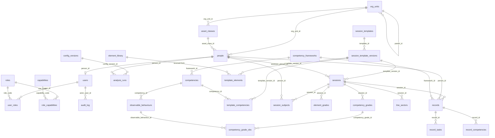

# 02 · Data model

Purpose: the complete schema blueprint for the core platform, the ETR module and the competency
framework — every table, column, key, index and trigger, with the reasoning wherever a choice is
load-bearing.
Status: spec + scaffolded (`scaffold/db/migrations/0001`–`0042`, extended forward by `0032`–`0035`)
Version: v1.0 · 2026-08-26

Covers migration ranges **0001–0019 (core)**, **0020–0039 (ETR)** and **0040–0059 (framework)**.
QMS (0060–0079), DMS (0080–0099), analytics (0100–0119) and integration (0120–0139) are specified in
`docs/08_QMS.md`, `docs/09_DMS.md`, `docs/06_ANALYTICS.md` and `docs/10_INTEGRATION.md`.

---

## 1. Ten decisions that shape everything below

Read these before reading a single `CREATE TABLE`. Each one is the fix for a failure that cost real
time in the system this kit is distilled from; each one is recorded again in `docs/16_TRAPS.md`.

| # | Decision | Why it is load-bearing |
|---|---|---|
| 1 | **Grade columns are `TEXT`, never `INTEGER`** | The same column must hold `1`–`5` and the non-scoring codes `NR`, `NO`, `NA`. An `INTEGER` column forces a parallel "was it required" boolean, which then disagrees with the grade. Numeric coercion happens in exactly one place, `grade_num(text)` (analytics range, `docs/06_ANALYTICS.md`), which returns `NULL` unless the input matches `^[1-5]$`. That function is the single definition of "valid grade". |
| 2 | **Answers key on `element_key`, never on a row surrogate id** | A template editor that re-saves a version rewrites element rows. Anything that stored `template_elements.id` loses its grades the first time an author fixes a typo. `element_grades.element_key` is a stable, author-assigned string, unique within a template version, and carries **no FK** to `template_elements` — deliberately, so a retired element cannot orphan a historical grade. |
| 3 | **Nothing keys on a competency name or an OB string** | `competency_grades.competency_id` and `competency_grade_obs.observable_behaviour_id` are ids. Names and OB text are display strings, editable with an `UPDATE`. Name-matching de-aligns the first time wording drifts (`and` vs `&`, `Situation` vs `Situational`) and fails silently. |
| 4 | **Every graded or evidence-bearing row carries `framework_id`** | Two framework editions coexist without a data migration. Records graded under an earlier edition stay readable exactly as graded; analytics scope to one `framework_id` at a time. A framework change is not a rename and must never be force-mapped. |
| 5 | **`records` is the single home for app-produced and imported records** | `records.source IN ('app','import','ingest')`. The predecessor kept in-app grades in one set of tables and ingested-document grades in another; every aggregate that read one source silently reported zeros for the other, and an entire 488-session import was invisible on the dashboard. Here there is one table to read, and `source` is a filter, never a separate home. |
| 6 | **Every attempt is a row** | `element_grades.attempt INT NOT NULL DEFAULT 1`, unique per `(session, person, element_key, instance_no, attempt)` since `0034`. Storing only the last attempt hides the initial failure: a task graded 2 then 4 reads as "meets standard". Below-standard counts roughly double once every attempt is counted. |
| 7 | **Soft delete everywhere** | `deleted_at TIMESTAMPTZ` on every table a human can delete from, plus an `audit_log` row. Nothing in this platform hard-deletes a record, a document or a person. Every read path filters `deleted_at IS NULL`; the partial indexes below are all `WHERE deleted_at IS NULL` so the filter is free. |
| 8 | **`users.is_active` and `people.is_active` are independent** | Leaving the organisation and losing a login are different events, in either order. Collapsing them into one flag makes it impossible to keep a departed person's training history readable while their login is gone. |
| 9 | **The catalogue tables join by `code TEXT`, not by surrogate id** | `roles.code`, `capabilities.code`, `role_capabilities(role_code, capability_code)`. Seeds, audit rows, config files and route guards all name a capability the same way, and a permission grant is readable without a join. Adding a permission is an `INSERT`, never a schema change. |
| 10 | **No threshold, band boundary or weight is stored in a table default or a CHECK** | Policy lives in `scaffold/config/*.yaml`, is loaded into `config_versions` with a checksum, and is read at runtime. Retuning is a config bump, not a migration and not a redeploy. |

---

## 2. ER overview



The two grade paths are worth stating in words, because the diagram flattens them:

- **Live grading** writes `element_grades` + `competency_grades` (+ `competency_grade_obs`) against
  an open `sessions` row. These are mutable while `sessions.status = 'in_progress'`.
- **Finalising** freezes one `records` row per assessed subject, with `record_tasks` +
  `record_competencies` copied from the live grades and a `snapshot JSONB` holding everything the
  report needs. An **import** or **ingest** writes exactly the same three tables with no `sessions`
  row at all. Analytics read `records`; the live tables are the editing surface only.

---

## 3. Core (0001–0019)

### 3.1 `0001_extensions.sql`

`pgcrypto` (for `gen_random_uuid()`) and `citext` (for case-insensitive `username` / `email`
uniqueness without a functional index on every lookup). Nothing else — an extension that is not
used by a later migration does not belong here.

### 3.2 `0002_common_functions.sql`

| Object | Purpose |
|---|---|
| `set_updated_at()` | `BEFORE UPDATE` trigger function; sets `NEW.updated_at = now()`. Attached to every table with an `updated_at` column. |
| `deny_mutation()` | `BEFORE UPDATE OR DELETE` trigger function; `RAISE EXCEPTION`. Attached to append-only tables. The predecessor left append-only as a convention; a convention is not a control an auditor accepts. |
| `deny_hard_delete()` | `BEFORE DELETE` guard for tables where a hard delete is always a mistake. Attached to `people`, `sessions` and `records`; deliberately NOT to `users`, where purging login credentials is legitimate. |

### 3.3 `org_units`

Org sub-unit: AOC, brand, base, department. Self-referencing, so a base under a brand under an AOC
is three rows, not three columns.

| Column | Type | Constraints |
|---|---|---|
| `id` | `UUID` | PK, `DEFAULT gen_random_uuid()` |
| `code` | `TEXT` | `NOT NULL`, unique among live rows |
| `name` | `TEXT` | `NOT NULL` |
| `kind` | `TEXT` | `NOT NULL`, `CHECK (kind IN ('operator','aoc','brand','base','department'))` |
| `parent_id` | `UUID` | `REFERENCES org_units(id)` |
| `position` | `INT` | `NOT NULL DEFAULT 0` |
| `is_active` | `BOOLEAN` | `NOT NULL DEFAULT true` |
| `created_at` / `updated_at` | `TIMESTAMPTZ` | `NOT NULL DEFAULT now()` |
| `deleted_at` | `TIMESTAMPTZ` | soft delete |

Indexes: `UNIQUE (code) WHERE deleted_at IS NULL`; `(parent_id)`. Trigger: `set_updated_at`.

### 3.4 `asset_classes`

The aircraft type / type-class / simulator class a session and a person are bucketed by. A table,
never an enum — a new type is an `INSERT`, and an enum value cannot be retired.

| Column | Type | Constraints |
|---|---|---|
| `id` | `UUID` | PK |
| `code` | `TEXT` | `NOT NULL`, unique among live rows |
| `name` | `TEXT` | `NOT NULL` |
| `category` | `TEXT` | `CHECK (category IN ('aircraft','simulator','other'))`, default `'aircraft'` |
| `org_unit_id` | `UUID` | `REFERENCES org_units(id)` |
| `position` | `INT` | `NOT NULL DEFAULT 0` |
| `is_active` | `BOOLEAN` | `NOT NULL DEFAULT true` |
| `created_at` / `updated_at` / `deleted_at` | `TIMESTAMPTZ` | |

### 3.5 `people`

The roster. One row per human the platform trains, assesses or reports on — subjects and assessors
alike, because the same person is both, often in the same week.

| Column | Type | Constraints / notes |
|---|---|---|
| `id` | `UUID` | PK |
| `external_id` | `TEXT` | `NOT NULL`, unique among live rows. The operator's own person id. **Every scope check and every import mapping keys on this**, never on `id`. |
| `full_name` | `TEXT` | `NOT NULL` |
| `position` | `TEXT` | seat / rank, normalised on write by the importer |
| `org_unit_id` | `UUID` | `REFERENCES org_units(id)` |
| `asset_class_id` | `UUID` | `REFERENCES asset_classes(id)` — **current** class; see Traps |
| `instructor_role` | `TEXT` | highest assessor qualification held, or `NULL`. Derived, refreshed on role change. |
| `is_active` | `BOOLEAN` | `NOT NULL DEFAULT true`. `false` = no longer on the roster. |
| `joined_on` | `DATE` | |
| `watch_list` | `BOOLEAN` | `NOT NULL DEFAULT false` |
| `concern_override` | `TEXT` | manual concern level, wins over the derived value |
| `created_at` / `updated_at` / `deleted_at` | `TIMESTAMPTZ` | |

Indexes: `UNIQUE (external_id) WHERE deleted_at IS NULL`; `(org_unit_id, asset_class_id) WHERE deleted_at IS NULL AND is_active`; `(watch_list) WHERE watch_list`.

`concern_override` exists so that the concern rule has exactly **one** implementation: override
wins, else the derived rule, else `NULL`. Two independent derivations is the single most reliably
reproduced correctness bug in this domain — one surface showed 480 subjects as blank while another
showed the same subjects as High.

### 3.6 `users`

Login only. No profile fields — those live on `people`.

| Column | Type | Constraints |
|---|---|---|
| `id` | `UUID` | PK |
| `person_id` | `UUID` | `REFERENCES people(id)`, unique among live rows, nullable (a break-glass admin has no roster row) |
| `username` | `CITEXT` | `NOT NULL`, unique among live rows |
| `email` | `CITEXT` | unique among live rows |
| `password_hash` | `TEXT` | `NOT NULL` — bcrypt, cost from `app_settings`, never below 12 |
| `must_change_password` | `BOOLEAN` | `NOT NULL DEFAULT true` |
| `is_active` | `BOOLEAN` | `NOT NULL DEFAULT true` — disables **login only** |
| `last_login_at` | `TIMESTAMPTZ` | |
| `failed_login_count` | `INT` | `NOT NULL DEFAULT 0` |
| `locked_until` | `TIMESTAMPTZ` | |
| `created_at` / `updated_at` / `deleted_at` | `TIMESTAMPTZ` | |

The session cookie carries `user_id` and nothing else that authorisation depends on. `person_id`
and `external_id` are re-read on every request, so an administrator's edit is never stale in a
live session.

### 3.7 `roles` and `user_roles`

`roles` is a catalogue, keyed by `code TEXT` (PK). Columns: `code`, `name`, `module`
(`platform | training | qms | dms | integration`), `description`, `is_system BOOLEAN NOT NULL DEFAULT true`,
`position INT`, `created_at`. Roles are **module-scoped**: a QMS admin is not a training admin.

`user_roles`: `id UUID PK`, `user_id UUID NOT NULL REFERENCES users(id) ON DELETE CASCADE`,
`role_code TEXT NOT NULL REFERENCES roles(code)`, `org_unit_id UUID NULL REFERENCES org_units(id)`,
`granted_by UUID REFERENCES users(id)`, `granted_at TIMESTAMPTZ NOT NULL DEFAULT now()`,
`expires_at TIMESTAMPTZ NULL`.

Uniqueness is a functional index, because `NULL` org_unit means "all org units" and `NULL` never
collides in a plain `UNIQUE`:

```sql
CREATE UNIQUE INDEX user_roles_uniq
  ON user_roles (user_id, role_code, COALESCE(org_unit_id, '00000000-0000-0000-0000-000000000000'::uuid));
```

`ON DELETE CASCADE` from `users` is the one place a cascade is correct: a role grant has no meaning
without its user, and the grant history lives in `audit_log`, not here.

### 3.8 `capabilities` and `role_capabilities`

`capabilities`: `code TEXT PK` (dotted, e.g. `training.templates.configure`), `module TEXT NOT NULL`,
`resource TEXT NOT NULL`, `action TEXT NOT NULL`, `is_scoped BOOLEAN NOT NULL DEFAULT false`,
`is_overridable BOOLEAN NOT NULL DEFAULT true`, `description TEXT`, `created_at`.

`role_capabilities`: `id UUID PK`, `role_code TEXT NOT NULL REFERENCES roles(code) ON DELETE CASCADE`,
`capability_code TEXT NOT NULL REFERENCES capabilities(code) ON DELETE CASCADE`,
`scope TEXT NOT NULL DEFAULT 'own' CHECK (scope IN ('own','assigned','team','org','all'))`,
`UNIQUE (role_code, capability_code, scope)`.

A role may hold the same capability at two scopes. The resolver unions the member sets of **all**
held scopes rather than collapsing to the widest — see `docs/12_ROLES_AND_PERMISSIONS.md` §5.

`is_overridable = false` marks a policy hard-gate: a capability that no per-user grant may ever
confer, whatever a future override mechanism does. Certificate visibility is the canonical example.

### 3.9 `audit_log`

Append-only, enforced. `id BIGINT GENERATED ALWAYS AS IDENTITY PK`, `occurred_at TIMESTAMPTZ NOT NULL DEFAULT now()`,
`actor_user_id UUID NULL REFERENCES users(id)`, `actor_label TEXT` (survives the user row),
`action TEXT NOT NULL` (dotted, e.g. `record.delete`, `session.finalize`, `auth.login.failed`),
`entity_table TEXT`, `entity_id TEXT`, `capability_code TEXT`, `reason TEXT`, `request_ip INET`,
`user_agent TEXT`, `details JSONB NOT NULL DEFAULT '{}'`.

Indexes: `(occurred_at DESC)`; `(action text_pattern_ops, occurred_at DESC)` so the admin log filters
by prefix (`export.%`) without a sequential scan; `(entity_table, entity_id)`; `(actor_user_id, occurred_at DESC)`.

Trigger `audit_log_immutable BEFORE UPDATE OR DELETE ... EXECUTE FUNCTION deny_mutation()`, plus
`REVOKE UPDATE, DELETE ON audit_log FROM PUBLIC`. Writes are best-effort from the application: a
failed audit write is logged and never blocks the action it describes.

### 3.10 `config_versions` and `app_settings`

`config_versions` is where `scaffold/config/*.yaml` lands at boot: `id UUID PK`, `name TEXT NOT NULL`
(`analytics` / `policy` / `grading` / `ingestion`), `version TEXT NOT NULL`, `checksum TEXT NOT NULL`,
`payload JSONB NOT NULL`, `loaded_at`, `loaded_by`, `is_active BOOLEAN NOT NULL DEFAULT false`,
`UNIQUE (name, version)` and `CREATE UNIQUE INDEX config_versions_one_active ON config_versions (name) WHERE is_active`.

Every `analysis_runs` row stores the `config_version_id` it was computed under. A number in a
report that cannot be traced to a config version is not reproducible, and a retune silently
invalidates every stored figure that does not name its config.

`app_settings`: `key TEXT PK`, `value JSONB NOT NULL`, `description TEXT`, `updated_at`, `updated_by`.
Operational switches only (bcrypt cost, session lifetime, feature flags). **Not** analysis
thresholds — those are `config_versions`, versioned and checksummed.

---

## 4. ETR (0020–0039)

### 4.1 `session_templates` and `session_template_versions`

A **template** is the form definition. It is never edited in place once used: an author edits a
**draft version**, publishes it, and the published version is immutable. The predecessor saved a
template by deleting and reinserting all of its elements, which destroyed any seeded structure the
builder had not loaded and rewrote every element id under live grades. Versioning is the fix.

`session_templates`

| Column | Type | Constraints |
|---|---|---|
| `id` | `UUID` | PK |
| `code` | `TEXT` | `NOT NULL`, unique among live rows |
| `name` | `TEXT` | `NOT NULL` |
| `template_kind` | `TEXT` | `NOT NULL REFERENCES template_kinds(code)` since `0032`. Twelve process kinds, from `docs/04_ETR.md` §4 and `config/policy.yaml`. `0020` created it as a CHECK over six coarse families; see §5.6 |
| `asset_class_id` | `UUID` | `REFERENCES asset_classes(id)`, nullable = all classes |
| `org_unit_id` | `UUID` | `REFERENCES org_units(id)`, nullable = all units |
| `current_version_id` | `UUID` | `REFERENCES session_template_versions(id)` — the published version a new session gets. Added by `ALTER TABLE` at the foot of the same migration, because the reference is circular. |
| `is_active` | `BOOLEAN` | `NOT NULL DEFAULT true` |
| `created_by` | `UUID` | `REFERENCES users(id)` |
| `created_at` / `updated_at` / `deleted_at` | `TIMESTAMPTZ` | |

`session_template_versions`

| Column | Type | Constraints / notes |
|---|---|---|
| `id` | `UUID` | PK |
| `template_id` | `UUID` | `NOT NULL REFERENCES session_templates(id) ON DELETE CASCADE` |
| `version` | `INT` | `NOT NULL`, `UNIQUE (template_id, version)` |
| `status` | `TEXT` | `NOT NULL DEFAULT 'draft' CHECK (status IN ('draft','published','retired'))` |
| `framework_id` | `UUID` | the framework this version grades against (FK added in 0042) |
| `period` | `TEXT` | free-form validity label, validated in the UI, never parsed by SQL |
| `effective_from` | `DATE` | |
| `published_at` / `published_by` | `TIMESTAMPTZ` / `UUID` | |
| `setup` | `JSONB` | `NOT NULL DEFAULT '{}'` — default session setup (route, mass, weather, position, notes) |
| `allowed_assessor_roles` | `TEXT[]` | `NOT NULL DEFAULT '{}'`; empty = every assessor role. **Re-validated server-side on session creation** — a client that omits it must not silently widen eligibility |
| `hide_record_from_subject` | `BOOLEAN` | `NOT NULL DEFAULT false`; copied onto each `records` row at finalise |
| `notes` | `TEXT` | |
| `created_at` / `updated_at` / `deleted_at` | `TIMESTAMPTZ` | |

Immutability is a trigger, not a convention: `BEFORE UPDATE OR DELETE` on `template_elements` and
`template_competencies` raises if the parent version's `status = 'published'`. Editing a published
template means cloning it to a new draft version.

### 4.2 `template_elements`

One element of a template: a section header, a graded task, a reset, a malfunction, a block of
text, a signature block.

| Column | Type | Constraints / notes |
|---|---|---|
| `id` | `UUID` | PK — an internal handle for the editor only. **Nothing outside the editor stores it.** |
| `template_version_id` | `UUID` | `NOT NULL REFERENCES session_template_versions(id) ON DELETE CASCADE` |
| `element_key` | `TEXT` | `NOT NULL`, `UNIQUE (template_version_id, element_key)`, `CHECK (element_key ~ '^[a-z0-9][a-z0-9_.-]{0,62}$')`. Author-assigned, stable across edits and across versions of the same template. This is what a grade points at. |
| `parent_key` | `TEXT` | the `element_key` of the containing section, or `NULL` for a top-level element. A key, not an id, for the same reason. |
| `element_type` | `TEXT` | `NOT NULL CHECK` over the element catalogue of `docs/05_TEMPLATES_AND_BUILDER.md` §2: `section, task, setup, event_option, note, field, computed, group`. Widened by `0033`, which also retained `reset, malfunction, text, signature` as superseded spellings; see §5.6 |
| `title` | `TEXT` | |
| `external_ref` | `TEXT` | the syllabus item number from the source curriculum. **An import mapping key, never an identity** — curricula renumber between editions, and a renumber must not split one task across seven buckets. |
| `position` | `INT` | `NOT NULL DEFAULT 0` |
| `is_mandatory` | `BOOLEAN` | `NOT NULL DEFAULT false` |
| `is_graded` | `BOOLEAN` | `NOT NULL DEFAULT true` — `false` for sections, text and signature blocks |
| `max_attempts` | `INT` | `NULL` = unlimited |
| `content` | `JSONB` | `NOT NULL DEFAULT '{}'` — `{ time, total_time, pf_role, notes, resets, position, environment, grid_options, text, performance_criteria }`. `grid_options` is an array of `{ key, name, trigger }`; each option carries its own key so a multi-select answer is also key-addressed. |
| `created_at` / `updated_at` | `TIMESTAMPTZ` | |

Indexes: `(template_version_id, position)`; `(external_ref) WHERE external_ref IS NOT NULL`.

### 4.3 `template_competencies`

Which competencies this template version assesses, and in what order.

`id UUID PK`, `template_version_id UUID NOT NULL REFERENCES session_template_versions(id) ON DELETE CASCADE`,
`framework_id UUID NOT NULL`, `competency_id UUID NOT NULL` (FKs added in 0042),
`position INT NOT NULL DEFAULT 0`, `is_required BOOLEAN NOT NULL DEFAULT true`,
`allowed_ob_ids UUID[] NOT NULL DEFAULT '{}'` (added in `0035`; empty means every OB of the
competency, resolved from the framework at read time), `UNIQUE (template_version_id, competency_id)`.

There is no `skill_name TEXT` column and there never will be. The grading UI renders competencies
by joining to `competencies` at read time and displaying `competencies.name`.

### 4.4 `element_library`

Reusable elements the builder offers when authoring: `id UUID PK`, `code TEXT NOT NULL` unique among
live rows, `element_type TEXT NOT NULL`, `title TEXT`, `external_ref TEXT`, `asset_class_id UUID`,
`tags TEXT[] NOT NULL DEFAULT '{}'`, `content JSONB NOT NULL DEFAULT '{}'`,
`is_active BOOLEAN NOT NULL DEFAULT true`, `created_at` / `updated_at` / `deleted_at`.

Copying a library element into a template **copies** its content; it does not reference it. A
library edit must never change the meaning of a published template.

### 4.5 `sessions`

One graded training event. One to four assessed subjects, one or two assessors.

| Column | Type | Constraints / notes |
|---|---|---|
| `id` | `UUID` | PK |
| `template_version_id` | `UUID` | `NOT NULL REFERENCES session_template_versions(id)` — **no `ON DELETE CASCADE`**, deliberately. A template with sessions cannot be removed; children come first, loudly. |
| `framework_id` | `UUID` | copied from the template version at creation, so a later framework switch cannot retro-relabel this session |
| `org_unit_id` / `asset_class_id` | `UUID` | copied at creation; see the fleet-drift trap |
| `session_date` | `DATE` | `NOT NULL` |
| `facility` | `TEXT` | |
| `facility_kind` | `TEXT` | `CHECK (facility_kind IN ('ffs','ftd','classroom','aircraft','line','other'))` |
| `assessor_person_id` | `UUID` | `REFERENCES people(id)` — an id, not a free-text name. The predecessor stored the assessor as text on ingested records and could not attribute anything. |
| `second_assessor_person_id` | `UUID` | `REFERENCES people(id)` |
| `status` | `TEXT` | `NOT NULL DEFAULT 'in_progress' CHECK (status IN ('in_progress','submitted','signed','finalized','void'))` |
| `outcome` | `TEXT` | assessor-entered |
| `computed_outcome` | `TEXT` | derived from the grades by the deterministic core; kept beside `outcome` so a disagreement is visible rather than overwritten |
| `remarks` | `TEXT` | |
| `setup` | `JSONB` | `NOT NULL DEFAULT '{}'`, seeded from the template version |
| `assessor_signed_at` / `assessor_signer_id` | `TIMESTAMPTZ` / `UUID` | |
| `created_by` | `UUID` | `REFERENCES users(id)` |
| `created_at` / `updated_at` / `deleted_at` | `TIMESTAMPTZ` | |

Indexes: `(session_date DESC) WHERE deleted_at IS NULL`; `(assessor_person_id, session_date DESC)`;
`(template_version_id)`; `(status) WHERE status <> 'finalized'`.

### 4.6 `session_subjects`

`id UUID PK`, `session_id UUID NOT NULL REFERENCES sessions(id) ON DELETE CASCADE`,
`person_id UUID NOT NULL REFERENCES people(id)`, `seat_role TEXT NOT NULL`,
`is_assessed BOOLEAN NOT NULL DEFAULT true`, `outcome TEXT`, `subject_signed_at TIMESTAMPTZ`,
`subject_signer_id UUID`, `created_at`, `UNIQUE (session_id, person_id)`.

`is_assessed = false` covers the support seat: present, logged, not graded. This is also the seam
the `assigned` permission scope reads — the set of subjects an assessor actually taught is derived
from `session_subjects` of sessions they led, in **one** helper, never re-derived per call site.

### 4.7 `element_grades`

| Column | Type | Constraints |
|---|---|---|
| `id` | `UUID` | PK |
| `session_id` | `UUID` | `NOT NULL REFERENCES sessions(id) ON DELETE CASCADE` |
| `person_id` | `UUID` | `NOT NULL REFERENCES people(id)` |
| `element_key` | `TEXT` | `NOT NULL` — no FK, by design (decision 2) |
| `instance_no` | `INT` | `NOT NULL DEFAULT 1 CHECK (instance_no >= 1)` — which instance of a repeatable `group` this answer belongs to. Added in `0034` |
| `attempt` | `INT` | `NOT NULL DEFAULT 1 CHECK (attempt >= 1)` |
| `value_text` / `value_num` / `value_date` | `TEXT` / `NUMERIC` / `DATE` | the answer to a `field` element, by field type. Added in `0034`. Separate from `grade`, because a recorded value is not a judgement and must not enter a grade distribution |
| `grade` | `TEXT` | `NULL` = cleared. No CHECK on the value: the vocabulary is config, and a CHECK is a migration. |
| `remark` | `TEXT` | |
| `graded_at` | `TIMESTAMPTZ` | `NOT NULL DEFAULT now()` |
| `graded_by` | `UUID` | `REFERENCES users(id)` |

`UNIQUE (session_id, person_id, element_key, instance_no, attempt)` since `0034`. Index `(session_id, person_id)`.

`instance_no` and `attempt` are independent axes and both are in the key. A second instance of a
repeatable group is a different row of the same form, not a second attempt at the first; an upsert
that names only `attempt` overwrites instance 1 with instance 2, and the loss looks like a subject
who was never entered.

The write path is an explicit upsert naming this conflict target. An upsert that does not name its
conflict target falls back to the primary key and raises `23505` on a legitimate re-edit — a bug
that passes every smoke test and only appears when a real assessor corrects a grade.

### 4.8 `competency_grades` and `competency_grade_obs`

`competency_grades`: `id UUID PK`, `session_id UUID NOT NULL REFERENCES sessions(id) ON DELETE CASCADE`,
`person_id UUID NOT NULL REFERENCES people(id)`, `framework_id UUID NOT NULL`,
`competency_id UUID NOT NULL`, `grade TEXT`, `remark TEXT`, `graded_at`, `graded_by`,
`UNIQUE (session_id, person_id, competency_id)`.

`competency_grade_obs`: `id UUID PK`,
`competency_grade_id UUID NOT NULL REFERENCES competency_grades(id) ON DELETE CASCADE`,
`observable_behaviour_id UUID NOT NULL`, `created_at`,
`UNIQUE (competency_grade_id, observable_behaviour_id)`.

OBs are **selected, not graded** — the junction row carries no grade of its own. A free-text remark
is never parsed back into OB references.

### 4.9 `records` — the frozen output

One row per assessed subject per session, and the same row shape for anything imported or ingested.

| Column | Type | Constraints / notes |
|---|---|---|
| `id` | `UUID` | PK |
| `session_id` | `UUID` | `REFERENCES sessions(id)`, `NULL` for imported and ingested records |
| `person_id` | `UUID` | `NOT NULL REFERENCES people(id)` |
| `source` | `TEXT` | `NOT NULL CHECK (source IN ('app','import','ingest'))` |
| `record_kind` | `TEXT` | e.g. recurrent, proficiency check, line check — a label, not an enum |
| `title` | `TEXT` | `NOT NULL` |
| `template_version_id` | `UUID` | `REFERENCES session_template_versions(id)`, `NULL` when the record predates the platform |
| `framework_id` | `UUID` | `NULL` only where no competency grade exists |
| `org_unit_id` / `asset_class_id` | `UUID` | frozen at the time of the event |
| `training_date` | `DATE` | `NOT NULL` |
| `assessor_person_id` | `UUID` | `REFERENCES people(id)`, `NULL` if unresolvable |
| `assessor_label` | `TEXT` | the raw assessor string from an imported document, kept for evidence |
| `outcome` | `TEXT` | |
| `outcome_override` | `TEXT` | an administrative correction; the original is never overwritten |
| `remarks` | `TEXT` | |
| `is_hidden_from_subject` | `BOOLEAN` | `NOT NULL DEFAULT false`, inherited from the template version |
| `document_id` | `UUID` | the DMS document this record was rendered from or into. No FK until 0080 creates `documents`; added there. |
| `snapshot` | `JSONB` | `NOT NULL DEFAULT '{}'` — competency names, OB texts, element titles, template name and version, config version, and the computed figure set **as they were**. A record must render correctly after its template is retired and its competency names are re-worded. |
| `external_ref` | `TEXT` | the source system's record id |
| `ingested_at` | `TIMESTAMPTZ` | |
| `created_by` | `UUID` | |
| `created_at` / `updated_at` / `deleted_at` | `TIMESTAMPTZ` | |

Indexes: `(person_id, training_date DESC) WHERE deleted_at IS NULL`;
`(source, training_date DESC)`; `(framework_id)`; `(assessor_person_id, training_date DESC)`;
`UNIQUE (person_id, external_ref) WHERE external_ref IS NOT NULL AND deleted_at IS NULL`;
`UNIQUE (session_id, person_id) WHERE session_id IS NOT NULL AND deleted_at IS NULL`.

### 4.10 `record_tasks` and `record_competencies`

`record_tasks`: `id UUID PK`, `record_id UUID NOT NULL REFERENCES records(id) ON DELETE CASCADE`,
`element_key TEXT NOT NULL`, `external_ref TEXT`, `task_name TEXT`, `position INT NOT NULL DEFAULT 0`,
`instance_no INT NOT NULL DEFAULT 1`, `attempt INT NOT NULL DEFAULT 1`, `grade TEXT`,
`value_text TEXT`, `value_num NUMERIC`, `value_date DATE`, `remark TEXT`, `created_at`,
`UNIQUE (record_id, element_key, instance_no, attempt)`.

The frozen copy carries the same answer columns as `element_grades` (`0034`) for one reason: a copy
that cannot represent what the session held loses rows at finalise, silently.

`element_key` is `NOT NULL` even for imports: the importer synthesises a stable key from the
normalised task name (lowercased, punctuation collapsed, the syllabus number stripped) and records
the raw number in `external_ref`. That is what stops one task splitting across buckets when the
curriculum renumbers, and it is done **once at import**, not at every read.

Every attempt is a row here too. A record that carries a single row per task is a record that has
already lost its first-attempt failures.

`record_competencies`: `id UUID PK`, `record_id UUID NOT NULL REFERENCES records(id) ON DELETE CASCADE`,
`framework_id UUID NOT NULL`, `competency_id UUID NOT NULL`, `grade TEXT`, `remark TEXT`,
`observable_behaviour_ids UUID[] NOT NULL DEFAULT '{}'`, `created_at`,
`UNIQUE (record_id, competency_id)`.

The OB selections are an array here, not a junction table, because a record is frozen: nothing ever
inserts into or deletes from a single record's OB set after finalise. A GIN index on
`observable_behaviour_ids` serves the "which OBs recur" query. The live table
`competency_grade_obs` stays a junction because it is edited element by element while grading.

### 4.11 `line_sectors`

Line flying under supervision, where the unit of assessment is a sector rather than a task.

`id UUID PK`, `session_id UUID REFERENCES sessions(id) ON DELETE CASCADE`,
`record_id UUID REFERENCES records(id) ON DELETE CASCADE`, `person_id UUID NOT NULL REFERENCES people(id)`,
`sector_number INT NOT NULL`, `flight_ref TEXT`, `sector_date DATE`, `departure TEXT`, `arrival TEXT`,
`pf_role TEXT`, `is_supervised BOOLEAN NOT NULL DEFAULT true`, `outcome TEXT`, `remark TEXT`,
`created_at`, `deleted_at`,
`CHECK (session_id IS NOT NULL OR record_id IS NOT NULL)`,
`UNIQUE (session_id, person_id, sector_number)`.

### 4.12 `analysis_runs`

One row per generated analysis of one person.

`id UUID PK`, `person_id UUID NOT NULL REFERENCES people(id)`, `framework_id UUID`,
`run_kind TEXT NOT NULL DEFAULT 'subject'`, `status TEXT NOT NULL DEFAULT 'queued' CHECK (status IN ('queued','running','complete','failed'))`,
`requested_by UUID REFERENCES users(id)`, `requested_at TIMESTAMPTZ NOT NULL DEFAULT now()`,
`completed_at TIMESTAMPTZ`, `config_version_id UUID REFERENCES config_versions(id)`,
`concern_level TEXT`, `figures JSONB NOT NULL DEFAULT '{}'`, `narrative_html TEXT`,
`narrative_model TEXT`, `sources JSONB NOT NULL DEFAULT '[]'`, `error TEXT`,
`created_at` / `deleted_at`.

`figures` is the computed figure set, produced entirely in SQL. `narrative_html` is the model's
prose, and it is validated against `figures` before it is stored. No number in a report originates
in an LLM. `sources` lists the `records` rows the run consumed, so a report is reproducible.

---

## 5. Framework (0040–0059)

The three tables of `docs/03_COMPETENCY_FRAMEWORK.md`. They are created **after** the ETR tables
because the contract fixes the migration ranges that way, so the `framework_id` and `competency_id`
columns in the ETR range are created bare and their foreign keys are added in `0042`. See Traps.

### 5.1 `competency_frameworks`

`id UUID PK`, `code TEXT NOT NULL UNIQUE`, `name TEXT NOT NULL`, `edition TEXT`, `source_ref TEXT`,
`effective_from DATE`, `is_active BOOLEAN NOT NULL DEFAULT false`, `created_at`,
plus `CREATE UNIQUE INDEX competency_frameworks_one_active ON competency_frameworks (is_active) WHERE is_active`.

Exactly one framework is active at a time; inactive frameworks stay fully readable, which is what
makes historical grades survive an edition change untouched.

### 5.2 `competencies`

`id UUID PK`, `framework_id UUID NOT NULL REFERENCES competency_frameworks(id) ON DELETE CASCADE`,
`code TEXT NOT NULL`, `"index" INT NOT NULL`, `name TEXT NOT NULL`, `description TEXT`,
`colour TEXT NOT NULL`, `position INT NOT NULL`, `is_active BOOLEAN NOT NULL DEFAULT true`,
`created_at`, `UNIQUE (framework_id, code)`, `UNIQUE (framework_id, "index")`.

`index` is quoted in DDL. `colour` is a stored token, so a rebrand is an `UPDATE` and the radar,
the heatmap and the PDF all change together. Nothing anywhere hardcodes nine competencies: the
radar renders one spoke per row.

### 5.3 `observable_behaviours`

`id UUID PK`, `competency_id UUID NOT NULL REFERENCES competencies(id) ON DELETE CASCADE`,
`framework_id UUID NOT NULL REFERENCES competency_frameworks(id) ON DELETE CASCADE`,
`code TEXT NOT NULL`, `text TEXT NOT NULL`, `position INT NOT NULL`,
`is_active BOOLEAN NOT NULL DEFAULT true`, `created_at`,
`UNIQUE (framework_id, code)`, `CHECK (code ~ '^OB [0-8]\.[0-9]{1,2}$')`.

`framework_id` is denormalised onto this table on purpose: every analytics query scopes to a
framework, and reaching it through `competencies` adds a join to the hottest path in the system.
A trigger keeps it consistent with the parent competency.

### 5.4 `0041` — seed placeholder

`0041_seed_framework.sql` creates no tables. It creates `framework_seed_verify(uuid)`, the assertion
the seeder calls after loading `scaffold/db/seed/competency_framework.json`: 9 competencies, OB
counts `7,7,10,6,7,11,9,7,9`, total 73, every OB code unique and well-formed. It raises on any
mismatch. The migration itself inserts nothing — the seed is data, loaded by
`scripts/seed-framework.mjs`, so that re-seeding does not require a new migration number.

### 5.5 `0042` — deferred foreign keys

`ALTER TABLE ... ADD CONSTRAINT` for every `framework_id` / `competency_id` /
`observable_behaviour_id` column created in the 0020–0039 range:
`session_template_versions`, `template_competencies`, `sessions`, `competency_grades`,
`competency_grade_obs`, `records`, `record_competencies`, `analysis_runs`.

`record_competencies.observable_behaviour_ids` is an array and therefore carries no FK; its
referential integrity is asserted at import and by an analytics check view, not by the planner.

### 5.6 `0032`–`0035` — forward-only widenings of the ETR range

Migrations are forward-only, so where §3 and §4 above describe a table that a later migration has
changed, the later migration is the one in force. Four of them, all in the ETR range, all reconciling
the schema with a spec that was already written:

| Migration | Changes | Because |
|---|---|---|
| `0032_template_kinds.sql` | new catalogue table `template_kinds`; `session_templates.template_kind` drops its CHECK and gains a FK to it | `docs/04_ETR.md` §4 defines the kind vocabulary as **configuration an operator edits**, and a CHECK makes every edit a migration. `0020` allowed six coarse families for twelve process kinds, so the database recorded `simulator` for four different kinds of event |
| `0033_element_type_catalogue.sql` | widens the `element_type` CHECK on `template_elements` and `element_library` to the eight types of `docs/05_TEMPLATES_AND_BUILDER.md` §2 | `field`, `computed` and `group` had no stored type of their own and were kept in a JSONB key. This one stays a CHECK, not a catalogue table: every type needs a renderer branch, so a new one is a code change by definition |
| `0034_element_answer_columns.sql` | adds `instance_no` and `value_text` / `value_num` / `value_date` to `element_grades` **and** `record_tasks`; moves `instance_no` into the uniqueness on both | `docs/05` §4 stores field answers and repeatable-group instances there and the columns did not exist |
| `0035_template_competency_ob_narrowing.sql` | adds `template_competencies.allowed_ob_ids UUID[]` | `docs/05` §1 gives the column and §3 gives the builder tab that writes it |

None of them rewrites data. `0032` keeps the six retired family codes in the catalogue so pre-`0032`
rows stay referentially valid, and `0033` keeps the four superseded element types allowed, because
mapping `simulator` onto one of four process kinds, or `text` onto one of three catalogue types,
would mean inventing a fact about somebody's training event.

---

## 6. Conventions applied to every table

| Convention | Applied as |
|---|---|
| Timestamps | `created_at TIMESTAMPTZ NOT NULL DEFAULT now()`; `updated_at` where a row is editable, maintained by the `set_updated_at` trigger, never by the application |
| Soft delete | `deleted_at TIMESTAMPTZ` on every table a human deletes from. Child tables of a soft-deleted parent are not touched — the parent's filter hides them |
| Read filters | every partial index is `WHERE deleted_at IS NULL`, so the mandatory filter costs nothing |
| Uniqueness | business keys are unique **among live rows** (`WHERE deleted_at IS NULL`), so a code can be reused after a soft delete |
| Comments | `COMMENT ON TABLE` on every table, stating its purpose in one sentence. `psql \dt+` is then a usable map of the schema |
| Grants | every migration ships its own `GRANT` statements. A module that shipped without them produced tables the application role could not read, and the failure looked like a caching bug for a day |
| Enums | none. Every constrained vocabulary is a `CHECK` on `TEXT`, or a catalogue table where the vocabulary is operator-editable. An enum value cannot be retired, and adding one has to be committed before any insert can use it |

---

## 7. Traps

**A name is not a key.** Any join, prompt guard, config file or chart axis that matches a competency
by name de-aligns the first time wording changes. It fails silently — the join simply returns fewer
rows. Join on `competency_id`; display `competencies.name` late, at render time.

**A row surrogate id is not a key either, when an editor can rewrite the row.** Grades that pointed
at `template_elements.id` vanish the moment an author re-saves a template. Store `element_key`. The
absence of an FK from `element_grades.element_key` to `template_elements` is deliberate and must not
be "fixed" by a later migration.

**Grade columns must be `TEXT`.** If an earlier build made them `INTEGER` or added a
`CHECK (grade BETWEEN 1 AND 5)`, drop the constraint *before*
`ALTER COLUMN grade TYPE TEXT USING grade::TEXT`, or the alter fails mid-migration and leaves the
table half-converted.

**Reading only one `source` reports zeros for the other.** `records.source` exists so that both
app-produced and imported records live in one table; a query that filters `source = 'app'` because
"that is where the real grades are" will be blind to an entire import. If a read surface needs to
distinguish them, it groups by `source` — it does not filter.

**Only the last attempt is not the grade.** Any aggregate that reads one row per task per record is
counting a repaired task as a pass. Below-standard counts roughly double when every attempt is
counted. Expand `attempt` in the aggregate, and take care with rows whose recorded grade is set but
whose attempt list holds an unparseable value — a naive unnest silently drops them.

**Two derivations of concern will disagree.** Concern is derived in one SQL function reading
`records`, with `people.concern_override` winning. Every surface reads that function. The moment a
second implementation exists — in a route handler, in a chart component — the list page and the
dashboard start showing different levels for the same person, and it is not obvious which is wrong.

**Fleet drift.** `people.asset_class_id` is the person's **current** class. Bucketing historical
grades by it makes a pilot's old grades follow them to a new type. `sessions.asset_class_id` and
`records.asset_class_id` are frozen copies for exactly this reason; analytics bucket by the frozen
column, never by the person.

**A framework change is not a rename.** Moving between frameworks splits some dimensions and merges
others. Historical grades cannot be redistributed retroactively. Version the framework, leave old
grades under their own `framework_id`, and start new baselines at the cut-over. Force-mapping
corrupts every trend line in the platform, and there is no way back.

**Deferred FKs must actually be added.** Because the framework range runs after the ETR range, the
`framework_id` columns exist unconstrained between `0020` and `0042`. If `0042` is skipped or fails,
the schema still works and still accepts orphan ids. Verify after migrating: every `framework_id`
column should appear in `information_schema.referential_constraints`.

**A cascade you did not intend.** Only three cascades exist in this range: from a user to its role
grants, from a session to its grades and subjects, and from a template version to its elements.
`sessions.template_version_id` and `records.session_id` deliberately do **not** cascade — deleting a
template or a session must fail loudly while dependent rows exist, and the correct action is a soft
delete anyway.

**Append-only by convention is not append-only.** `audit_log` carries a `deny_mutation` trigger and
a `REVOKE`. Without them, "append-only" is a comment, and the first data-fix script to touch the
table removes the evidence it was there to preserve.

**`users` is a safe table name here, and only here.** This kit reaches PostgreSQL directly with
`pg`. If the REST-over-Postgres variant noted in `docs/15_DEPLOYMENT.md` is adopted, `users` collides with the
platform's internal `auth.users` and every request against it fails with a schema-cache error; the
table must be renamed before that swap, not after.
